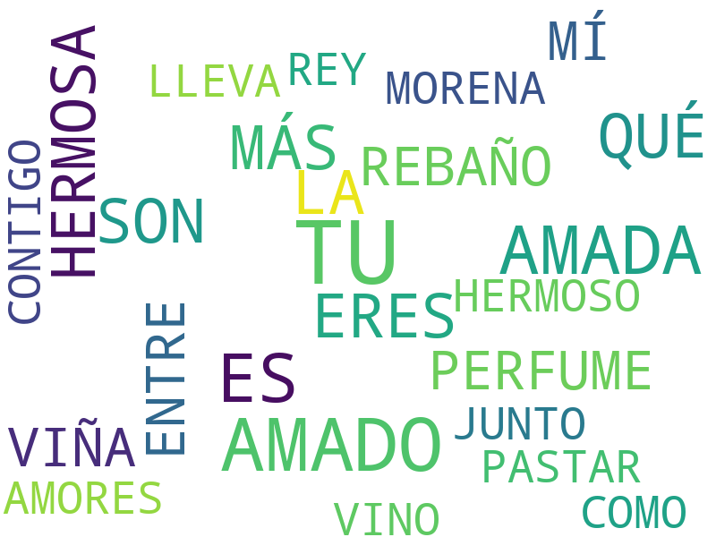
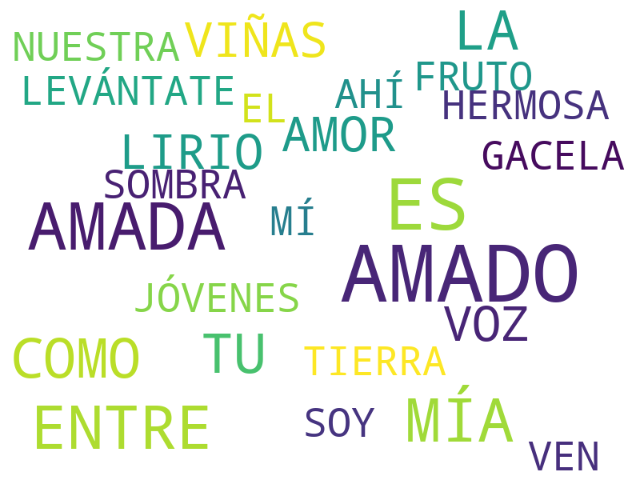
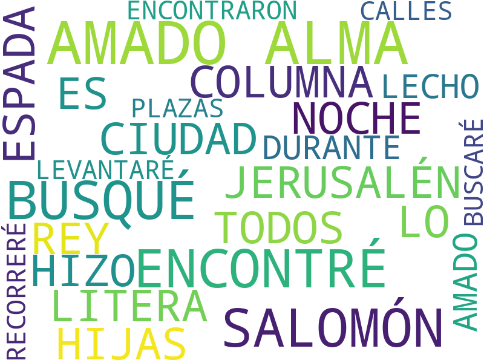
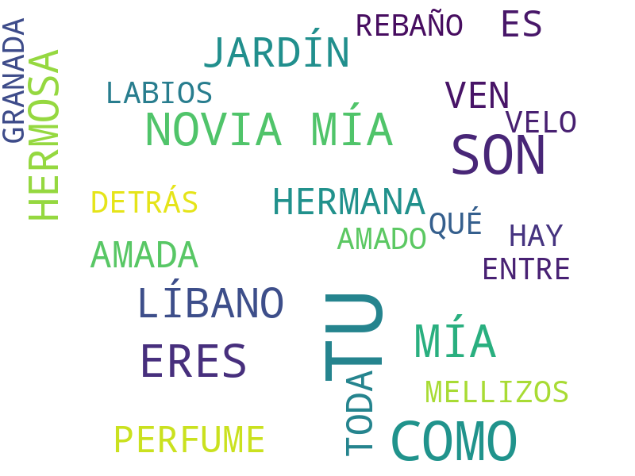
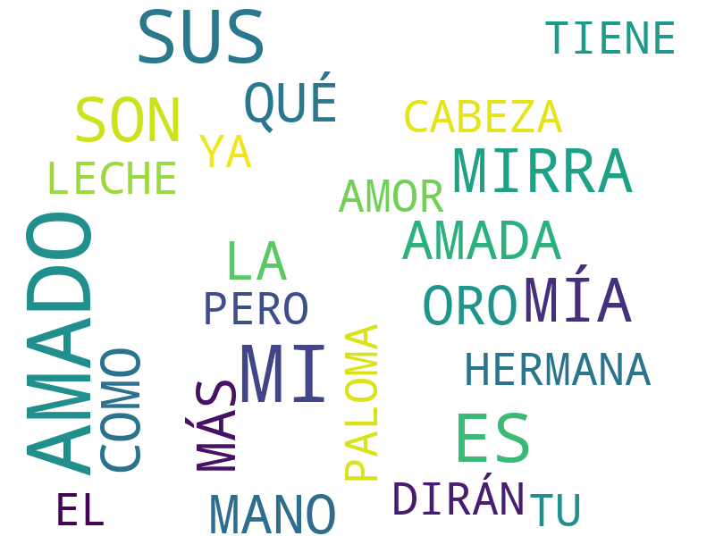
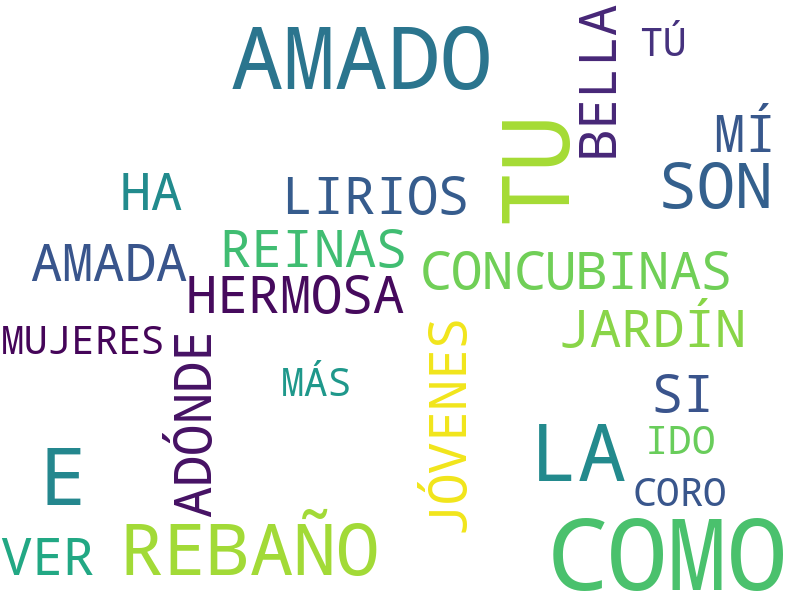
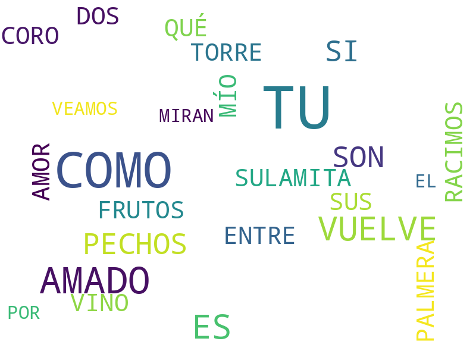
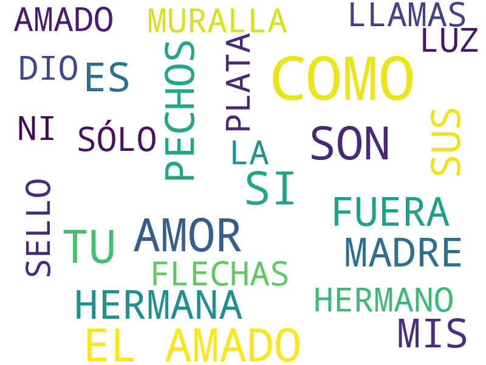

# Cantar_de_los_Cantares

1. Capítulo 1 [texto](texto_filtrado/AT/Cant/Cant_1.txt), 
2. Capítulo 2 [texto](texto_filtrado/AT/Cant/Cant_2.txt), 
3. Capítulo 3 [texto](texto_filtrado/AT/Cant/Cant_3.txt), 
4. Capítulo 4 [texto](texto_filtrado/AT/Cant/Cant_4.txt), 
5. Capítulo 5 [texto](texto_filtrado/AT/Cant/Cant_5.txt), 
6. Capítulo 6 [texto](texto_filtrado/AT/Cant/Cant_6.txt), 
7. Capítulo 7 [texto](texto_filtrado/AT/Cant/Cant_7.txt), 
8. Capítulo 8 [texto](texto_filtrado/AT/Cant/Cant_8.txt), 
