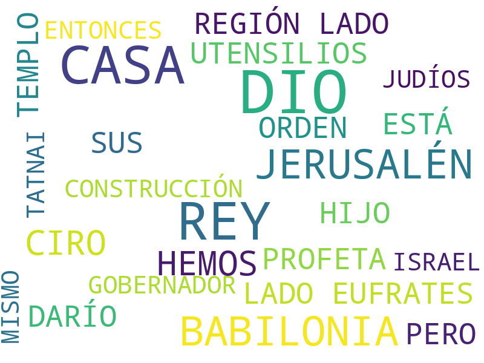
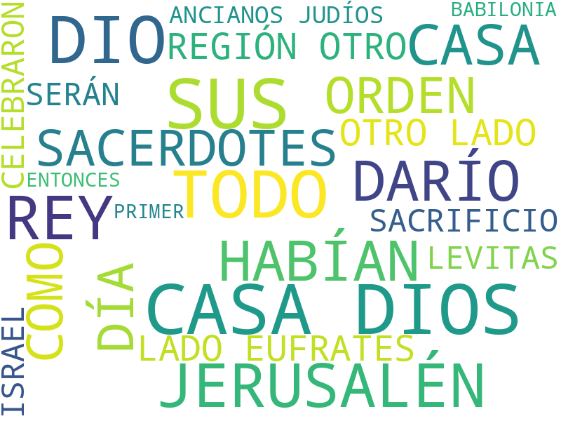

# Esdras

1. Capítulo 1 [texto](texto_filtrado/AT/Es/Es_1.txt), 
2. Capítulo 2 [texto](texto_filtrado/AT/Es/Es_2.txt), 
3. Capítulo 3 [texto](texto_filtrado/AT/Es/Es_3.txt), 
4. Capítulo 4 [texto](texto_filtrado/AT/Es/Es_4.txt), 
5. Capítulo 5 [texto](texto_filtrado/AT/Es/Es_5.txt), 
6. Capítulo 6 [texto](texto_filtrado/AT/Es/Es_6.txt), 
7. Capítulo 7 [texto](texto_filtrado/AT/Es/Es_7.txt), 
8. Capítulo 8 [texto](texto_filtrado/AT/Es/Es_8.txt), 
9. Capítulo 9 [texto](texto_filtrado/AT/Es/Es_9.txt), 
10. Capítulo 10 [texto](texto_filtrado/AT/Es/Es_10.txt), 
