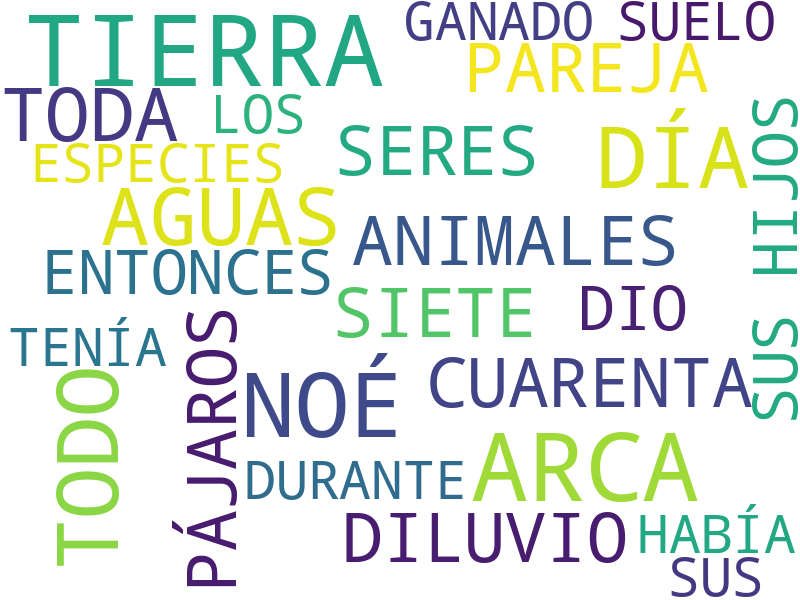
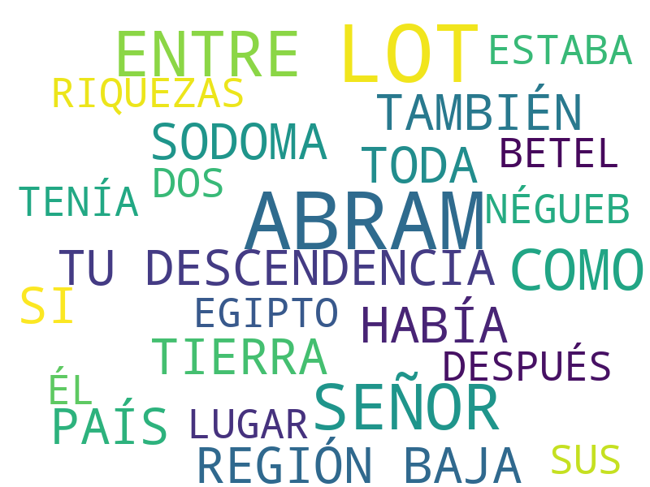
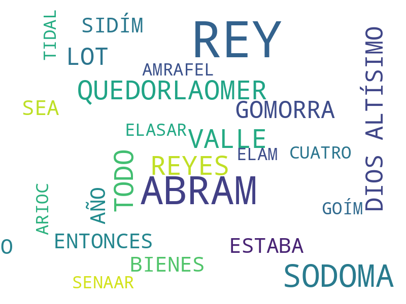

# Genesis

1. Capitulo 1 [texto](texto_filtrado/AT/Gn/Gn_1.txt), 
2. Capitulo 2 [texto](texto_filtrado/AT/Gn/Gn_2.txt), 
3. Capitulo 3 [texto](texto_filtrado/AT/Gn/Gn_3.txt), 
4. Capitulo 4 [texto](texto_filtrado/AT/Gn/Gn_4.txt), 
5. Capitulo 5 [texto](texto_filtrado/AT/Gn/Gn_5.txt), 
6. Capitulo 6 [texto](texto_filtrado/AT/Gn/Gn_6.txt), 
7. Capitulo 7 [texto](texto_filtrado/AT/Gn/Gn_7.txt), 
8. Capitulo 8 [texto](texto_filtrado/AT/Gn/Gn_8.txt), 
9. Capitulo 9 [texto](texto_filtrado/AT/Gn/Gn_9.txt), 
10. Capitulo 10 [texto](texto_filtrado/AT/Gn/Gn_10.txt), 
11. Capitulo 11 [texto](texto_filtrado/AT/Gn/Gn_11.txt), 
12. Capitulo 12 [texto](texto_filtrado/AT/Gn/Gn_12.txt), 
13. Capitulo 13 [texto](texto_filtrado/AT/Gn/Gn_13.txt), 
14. Capitulo 14 [texto](texto_filtrado/AT/Gn/Gn_14.txt), 
15. Capitulo 15 [texto](texto_filtrado/AT/Gn/Gn_15.txt), 
16. Capitulo 16 [texto](texto_filtrado/AT/Gn/Gn_16.txt), 
17. Capitulo 17 [texto](texto_filtrado/AT/Gn/Gn_17.txt), 
18. Capitulo 18 [texto](texto_filtrado/AT/Gn/Gn_18.txt), 
19. Capitulo 19 [texto](texto_filtrado/AT/Gn/Gn_19.txt), 
20. Capitulo 20 [texto](texto_filtrado/AT/Gn/Gn_20.txt), 
21. Capitulo 21 [texto](texto_filtrado/AT/Gn/Gn_21.txt), 
22. Capitulo 22 [texto](texto_filtrado/AT/Gn/Gn_22.txt), 
23. Capitulo 23 [texto](texto_filtrado/AT/Gn/Gn_23.txt), 
24. Capitulo 24 [texto](texto_filtrado/AT/Gn/Gn_24.txt), 
25. Capitulo 25 [texto](texto_filtrado/AT/Gn/Gn_25.txt), 
26. Capitulo 26 [texto](texto_filtrado/AT/Gn/Gn_26.txt), 
27. Capitulo 27 [texto](texto_filtrado/AT/Gn/Gn_27.txt), 
28. Capitulo 28 [texto](texto_filtrado/AT/Gn/Gn_28.txt), 
29. Capitulo 29 [texto](texto_filtrado/AT/Gn/Gn_29.txt), 
30. Capitulo 30 [texto](texto_filtrado/AT/Gn/Gn_30.txt), 
31. Capitulo 31 [texto](texto_filtrado/AT/Gn/Gn_31.txt), 
32. Capitulo 32 [texto](texto_filtrado/AT/Gn/Gn_32.txt), 
33. Capitulo 33 [texto](texto_filtrado/AT/Gn/Gn_33.txt), 
34. Capitulo 34 [texto](texto_filtrado/AT/Gn/Gn_34.txt), 
35. Capitulo 35 [texto](texto_filtrado/AT/Gn/Gn_35.txt), 
36. Capitulo 36 [texto](texto_filtrado/AT/Gn/Gn_36.txt), 
37. Capitulo 37 [texto](texto_filtrado/AT/Gn/Gn_37.txt), 
38. Capitulo 38 [texto](texto_filtrado/AT/Gn/Gn_38.txt), 
39. Capitulo 39 [texto](texto_filtrado/AT/Gn/Gn_39.txt), 
40. Capitulo 40 [texto](texto_filtrado/AT/Gn/Gn_40.txt), 
41. Capitulo 41 [texto](texto_filtrado/AT/Gn/Gn_41.txt), 
42. Capitulo 42 [texto](texto_filtrado/AT/Gn/Gn_42.txt), 
43. Capitulo 43 [texto](texto_filtrado/AT/Gn/Gn_43.txt), 
44. Capitulo 44 [texto](texto_filtrado/AT/Gn/Gn_44.txt), 
45. Capitulo 45 [texto](texto_filtrado/AT/Gn/Gn_45.txt), 
46. Capitulo 46 [texto](texto_filtrado/AT/Gn/Gn_46.txt), 
47. Capitulo 47 [texto](texto_filtrado/AT/Gn/Gn_47.txt), 
48. Capitulo 48 [texto](texto_filtrado/AT/Gn/Gn_48.txt), 
49. Capitulo 49 [texto](texto_filtrado/AT/Gn/Gn_49.txt), 
50. Capitulo 50 [texto](texto_filtrado/AT/Gn/Gn_50.txt), 
