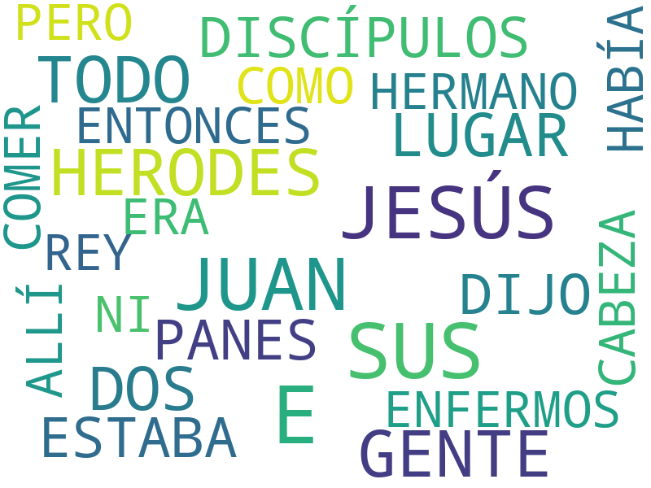

# Marcos

1. Capítulo 1 [texto](texto_filtrado/NT/Mc/Mc_1.txt), 
2. Capítulo 2 [texto](texto_filtrado/NT/Mc/Mc_2.txt), 
3. Capítulo 3 [texto](texto_filtrado/NT/Mc/Mc_3.txt), 
4. Capítulo 4 [texto](texto_filtrado/NT/Mc/Mc_4.txt), 
5. Capítulo 5 [texto](texto_filtrado/NT/Mc/Mc_5.txt), 
6. Capítulo 6 [texto](texto_filtrado/NT/Mc/Mc_6.txt), 
7. Capítulo 7 [texto](texto_filtrado/NT/Mc/Mc_7.txt), 
8. Capítulo 8 [texto](texto_filtrado/NT/Mc/Mc_8.txt), 
9. Capítulo 9 [texto](texto_filtrado/NT/Mc/Mc_9.txt), 
10. Capítulo 10 [texto](texto_filtrado/NT/Mc/Mc_10.txt), 
11. Capítulo 11 [texto](texto_filtrado/NT/Mc/Mc_11.txt), 
12. Capítulo 12 [texto](texto_filtrado/NT/Mc/Mc_12.txt), 
13. Capítulo 13 [texto](texto_filtrado/NT/Mc/Mc_13.txt), 
14. Capítulo 14 [texto](texto_filtrado/NT/Mc/Mc_14.txt), 
15. Capítulo 15 [texto](texto_filtrado/NT/Mc/Mc_15.txt), 
16. Capítulo 16 [texto](texto_filtrado/NT/Mc/Mc_16.txt), 
