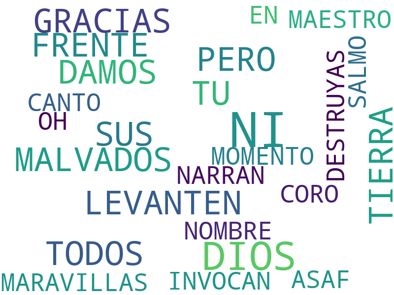
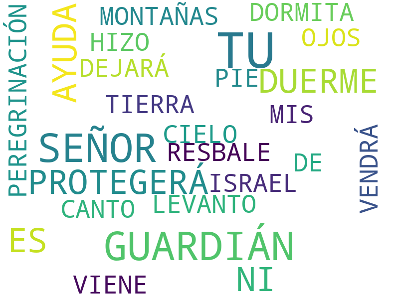
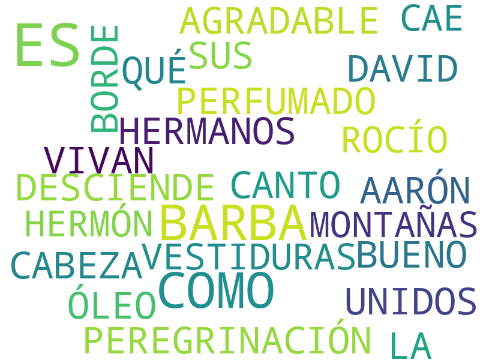
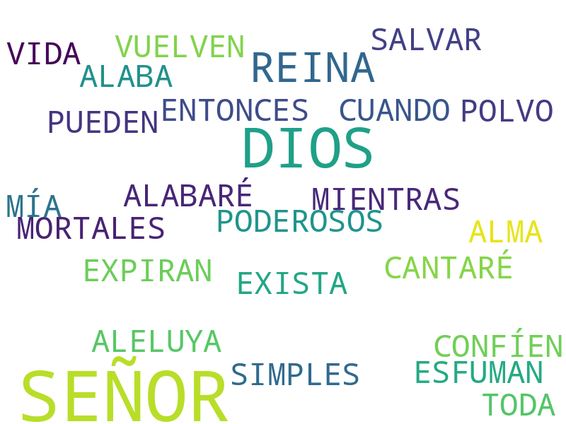
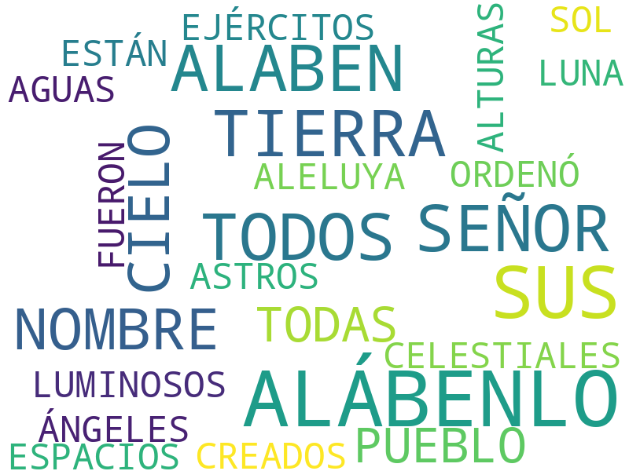
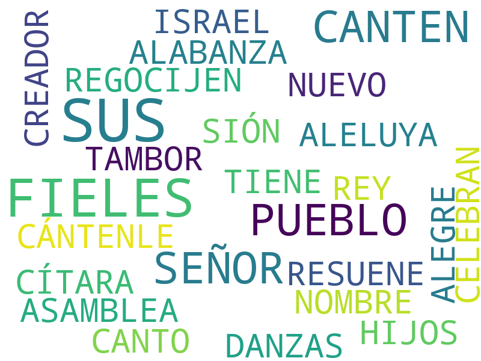

# Salmos

1. Capítulo 1 [texto](texto_filtrado/AT/Sal/Sal_1.txt), 
2. Capítulo 2 [texto](texto_filtrado/AT/Sal/Sal_2.txt), 
3. Capítulo 3 [texto](texto_filtrado/AT/Sal/Sal_3.txt), 
4. Capítulo 4 [texto](texto_filtrado/AT/Sal/Sal_4.txt), 
5. Capítulo 5 [texto](texto_filtrado/AT/Sal/Sal_5.txt), 
6. Capítulo 6 [texto](texto_filtrado/AT/Sal/Sal_6.txt), 
7. Capítulo 7 [texto](texto_filtrado/AT/Sal/Sal_7.txt), 
8. Capítulo 8 [texto](texto_filtrado/AT/Sal/Sal_8.txt), 
9. Capítulo 9 [texto](texto_filtrado/AT/Sal/Sal_9.txt), 
10. Capítulo 10 [texto](texto_filtrado/AT/Sal/Sal_10.txt), 
11. Capítulo 11 [texto](texto_filtrado/AT/Sal/Sal_11.txt), 
12. Capítulo 12 [texto](texto_filtrado/AT/Sal/Sal_12.txt), 
13. Capítulo 13 [texto](texto_filtrado/AT/Sal/Sal_13.txt), 
14. Capítulo 14 [texto](texto_filtrado/AT/Sal/Sal_14.txt), 
15. Capítulo 15 [texto](texto_filtrado/AT/Sal/Sal_15.txt), 
16. Capítulo 16 [texto](texto_filtrado/AT/Sal/Sal_16.txt), 
17. Capítulo 17 [texto](texto_filtrado/AT/Sal/Sal_17.txt), 
18. Capítulo 18 [texto](texto_filtrado/AT/Sal/Sal_18.txt), 
19. Capítulo 19 [texto](texto_filtrado/AT/Sal/Sal_19.txt), 
20. Capítulo 20 [texto](texto_filtrado/AT/Sal/Sal_20.txt), 
21. Capítulo 21 [texto](texto_filtrado/AT/Sal/Sal_21.txt), 
22. Capítulo 22 [texto](texto_filtrado/AT/Sal/Sal_22.txt), 
23. Capítulo 23 [texto](texto_filtrado/AT/Sal/Sal_23.txt), 
24. Capítulo 24 [texto](texto_filtrado/AT/Sal/Sal_24.txt), 
25. Capítulo 25 [texto](texto_filtrado/AT/Sal/Sal_25.txt), 
26. Capítulo 26 [texto](texto_filtrado/AT/Sal/Sal_26.txt), 
27. Capítulo 27 [texto](texto_filtrado/AT/Sal/Sal_27.txt), 
28. Capítulo 28 [texto](texto_filtrado/AT/Sal/Sal_28.txt), 
29. Capítulo 29 [texto](texto_filtrado/AT/Sal/Sal_29.txt), 
30. Capítulo 30 [texto](texto_filtrado/AT/Sal/Sal_30.txt), 
31. Capítulo 31 [texto](texto_filtrado/AT/Sal/Sal_31.txt), 
32. Capítulo 32 [texto](texto_filtrado/AT/Sal/Sal_32.txt), 
33. Capítulo 33 [texto](texto_filtrado/AT/Sal/Sal_33.txt), 
34. Capítulo 34 [texto](texto_filtrado/AT/Sal/Sal_34.txt), 
35. Capítulo 35 [texto](texto_filtrado/AT/Sal/Sal_35.txt), 
36. Capítulo 36 [texto](texto_filtrado/AT/Sal/Sal_36.txt), 
37. Capítulo 37 [texto](texto_filtrado/AT/Sal/Sal_37.txt), 
38. Capítulo 38 [texto](texto_filtrado/AT/Sal/Sal_38.txt), 
39. Capítulo 39 [texto](texto_filtrado/AT/Sal/Sal_39.txt), 
40. Capítulo 40 [texto](texto_filtrado/AT/Sal/Sal_40.txt), 
41. Capítulo 41 [texto](texto_filtrado/AT/Sal/Sal_41.txt), 
42. Capítulo 42 [texto](texto_filtrado/AT/Sal/Sal_42.txt), 
43. Capítulo 43 [texto](texto_filtrado/AT/Sal/Sal_43.txt), 
44. Capítulo 44 [texto](texto_filtrado/AT/Sal/Sal_44.txt), 
45. Capítulo 45 [texto](texto_filtrado/AT/Sal/Sal_45.txt), 
46. Capítulo 46 [texto](texto_filtrado/AT/Sal/Sal_46.txt), 
47. Capítulo 47 [texto](texto_filtrado/AT/Sal/Sal_47.txt), 
48. Capítulo 48 [texto](texto_filtrado/AT/Sal/Sal_48.txt), 
49. Capítulo 49 [texto](texto_filtrado/AT/Sal/Sal_49.txt), 
50. Capítulo 50 [texto](texto_filtrado/AT/Sal/Sal_50.txt), 
51. Capítulo 51 [texto](texto_filtrado/AT/Sal/Sal_51.txt), 
52. Capítulo 52 [texto](texto_filtrado/AT/Sal/Sal_52.txt), 
53. Capítulo 53 [texto](texto_filtrado/AT/Sal/Sal_53.txt), 
54. Capítulo 54 [texto](texto_filtrado/AT/Sal/Sal_54.txt), 
55. Capítulo 55 [texto](texto_filtrado/AT/Sal/Sal_55.txt), 
56. Capítulo 56 [texto](texto_filtrado/AT/Sal/Sal_56.txt), 
57. Capítulo 57 [texto](texto_filtrado/AT/Sal/Sal_57.txt), 
58. Capítulo 58 [texto](texto_filtrado/AT/Sal/Sal_58.txt), 
59. Capítulo 59 [texto](texto_filtrado/AT/Sal/Sal_59.txt), 
60. Capítulo 60 [texto](texto_filtrado/AT/Sal/Sal_60.txt), 
61. Capítulo 61 [texto](texto_filtrado/AT/Sal/Sal_61.txt), 
62. Capítulo 62 [texto](texto_filtrado/AT/Sal/Sal_62.txt), 
63. Capítulo 63 [texto](texto_filtrado/AT/Sal/Sal_63.txt), 
64. Capítulo 64 [texto](texto_filtrado/AT/Sal/Sal_64.txt), 
65. Capítulo 65 [texto](texto_filtrado/AT/Sal/Sal_65.txt), 
66. Capítulo 66 [texto](texto_filtrado/AT/Sal/Sal_66.txt), 
67. Capítulo 67 [texto](texto_filtrado/AT/Sal/Sal_67.txt), 
68. Capítulo 68 [texto](texto_filtrado/AT/Sal/Sal_68.txt), 
69. Capítulo 69 [texto](texto_filtrado/AT/Sal/Sal_69.txt), 
70. Capítulo 70 [texto](texto_filtrado/AT/Sal/Sal_70.txt), 
71. Capítulo 71 [texto](texto_filtrado/AT/Sal/Sal_71.txt), 
72. Capítulo 72 [texto](texto_filtrado/AT/Sal/Sal_72.txt), 
73. Capítulo 73 [texto](texto_filtrado/AT/Sal/Sal_73.txt), 
74. Capítulo 74 [texto](texto_filtrado/AT/Sal/Sal_74.txt), 
75. Capítulo 75 [texto](texto_filtrado/AT/Sal/Sal_75.txt), 
76. Capítulo 76 [texto](texto_filtrado/AT/Sal/Sal_76.txt), 
77. Capítulo 77 [texto](texto_filtrado/AT/Sal/Sal_77.txt), 
78. Capítulo 78 [texto](texto_filtrado/AT/Sal/Sal_78.txt), 
79. Capítulo 79 [texto](texto_filtrado/AT/Sal/Sal_79.txt), 
80. Capítulo 80 [texto](texto_filtrado/AT/Sal/Sal_80.txt), 
81. Capítulo 81 [texto](texto_filtrado/AT/Sal/Sal_81.txt), 
82. Capítulo 82 [texto](texto_filtrado/AT/Sal/Sal_82.txt), 
83. Capítulo 83 [texto](texto_filtrado/AT/Sal/Sal_83.txt), 
84. Capítulo 84 [texto](texto_filtrado/AT/Sal/Sal_84.txt), 
85. Capítulo 85 [texto](texto_filtrado/AT/Sal/Sal_85.txt), 
86. Capítulo 86 [texto](texto_filtrado/AT/Sal/Sal_86.txt), 
87. Capítulo 87 [texto](texto_filtrado/AT/Sal/Sal_87.txt), 
88. Capítulo 88 [texto](texto_filtrado/AT/Sal/Sal_88.txt), 
89. Capítulo 89 [texto](texto_filtrado/AT/Sal/Sal_89.txt), 
90. Capítulo 90 [texto](texto_filtrado/AT/Sal/Sal_90.txt), 
91. Capítulo 91 [texto](texto_filtrado/AT/Sal/Sal_91.txt), 
92. Capítulo 92 [texto](texto_filtrado/AT/Sal/Sal_92.txt), 
93. Capítulo 93 [texto](texto_filtrado/AT/Sal/Sal_93.txt), 
94. Capítulo 94 [texto](texto_filtrado/AT/Sal/Sal_94.txt), 
95. Capítulo 95 [texto](texto_filtrado/AT/Sal/Sal_95.txt), 
96. Capítulo 96 [texto](texto_filtrado/AT/Sal/Sal_96.txt), 
97. Capítulo 97 [texto](texto_filtrado/AT/Sal/Sal_97.txt), 
98. Capítulo 98 [texto](texto_filtrado/AT/Sal/Sal_98.txt), 
99. Capítulo 99 [texto](texto_filtrado/AT/Sal/Sal_99.txt), 
100. Capítulo 100 [texto](texto_filtrado/AT/Sal/Sal_100.txt), 
101. Capítulo 101 [texto](texto_filtrado/AT/Sal/Sal_101.txt), 
102. Capítulo 102 [texto](texto_filtrado/AT/Sal/Sal_102.txt), 
103. Capítulo 103 [texto](texto_filtrado/AT/Sal/Sal_103.txt), 
104. Capítulo 104 [texto](texto_filtrado/AT/Sal/Sal_104.txt), 
105. Capítulo 105 [texto](texto_filtrado/AT/Sal/Sal_105.txt), 
106. Capítulo 106 [texto](texto_filtrado/AT/Sal/Sal_106.txt), 
107. Capítulo 107 [texto](texto_filtrado/AT/Sal/Sal_107.txt), 
108. Capítulo 108 [texto](texto_filtrado/AT/Sal/Sal_108.txt), 
109. Capítulo 109 [texto](texto_filtrado/AT/Sal/Sal_109.txt), 
110. Capítulo 110 [texto](texto_filtrado/AT/Sal/Sal_110.txt), 
111. Capítulo 111 [texto](texto_filtrado/AT/Sal/Sal_111.txt), 
112. Capítulo 112 [texto](texto_filtrado/AT/Sal/Sal_112.txt), 
113. Capítulo 113 [texto](texto_filtrado/AT/Sal/Sal_113.txt), 
114. Capítulo 114 [texto](texto_filtrado/AT/Sal/Sal_114.txt), 
115. Capítulo 115 [texto](texto_filtrado/AT/Sal/Sal_115.txt), 
116. Capítulo 116 [texto](texto_filtrado/AT/Sal/Sal_116.txt), 
117. Capítulo 117 [texto](texto_filtrado/AT/Sal/Sal_117.txt), 
118. Capítulo 118 [texto](texto_filtrado/AT/Sal/Sal_118.txt), 
119. Capítulo 119 [texto](texto_filtrado/AT/Sal/Sal_119.txt), 
120. Capítulo 120 [texto](texto_filtrado/AT/Sal/Sal_120.txt), 
121. Capítulo 121 [texto](texto_filtrado/AT/Sal/Sal_121.txt), 
122. Capítulo 122 [texto](texto_filtrado/AT/Sal/Sal_122.txt), 
123. Capítulo 123 [texto](texto_filtrado/AT/Sal/Sal_123.txt), 
124. Capítulo 124 [texto](texto_filtrado/AT/Sal/Sal_124.txt), 
125. Capítulo 125 [texto](texto_filtrado/AT/Sal/Sal_125.txt), 
126. Capítulo 126 [texto](texto_filtrado/AT/Sal/Sal_126.txt), 
127. Capítulo 127 [texto](texto_filtrado/AT/Sal/Sal_127.txt), 
128. Capítulo 128 [texto](texto_filtrado/AT/Sal/Sal_128.txt), 
129. Capítulo 129 [texto](texto_filtrado/AT/Sal/Sal_129.txt), 
130. Capítulo 130 [texto](texto_filtrado/AT/Sal/Sal_130.txt), 
131. Capítulo 131 [texto](texto_filtrado/AT/Sal/Sal_131.txt), 
132. Capítulo 132 [texto](texto_filtrado/AT/Sal/Sal_132.txt), 
133. Capítulo 133 [texto](texto_filtrado/AT/Sal/Sal_133.txt), 
134. Capítulo 134 [texto](texto_filtrado/AT/Sal/Sal_134.txt), 
135. Capítulo 135 [texto](texto_filtrado/AT/Sal/Sal_135.txt), 
136. Capítulo 136 [texto](texto_filtrado/AT/Sal/Sal_136.txt), 
137. Capítulo 137 [texto](texto_filtrado/AT/Sal/Sal_137.txt), 
138. Capítulo 138 [texto](texto_filtrado/AT/Sal/Sal_138.txt), 
139. Capítulo 139 [texto](texto_filtrado/AT/Sal/Sal_139.txt), 
140. Capítulo 140 [texto](texto_filtrado/AT/Sal/Sal_140.txt), 
141. Capítulo 141 [texto](texto_filtrado/AT/Sal/Sal_141.txt), 
142. Capítulo 142 [texto](texto_filtrado/AT/Sal/Sal_142.txt), 
143. Capítulo 143 [texto](texto_filtrado/AT/Sal/Sal_143.txt), 
144. Capítulo 144 [texto](texto_filtrado/AT/Sal/Sal_144.txt), 
145. Capítulo 145 [texto](texto_filtrado/AT/Sal/Sal_145.txt), 
146. Capítulo 146 [texto](texto_filtrado/AT/Sal/Sal_146.txt), 
147. Capítulo 147 [texto](texto_filtrado/AT/Sal/Sal_147.txt), 
148. Capítulo 148 [texto](texto_filtrado/AT/Sal/Sal_148.txt), 
149. Capítulo 149 [texto](texto_filtrado/AT/Sal/Sal_149.txt), 
150. Capítulo 150 [texto](texto_filtrado/AT/Sal/Sal_150.txt), 
