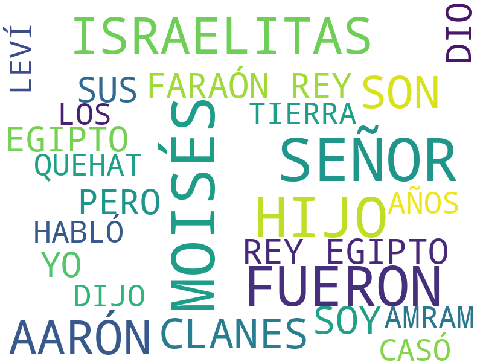
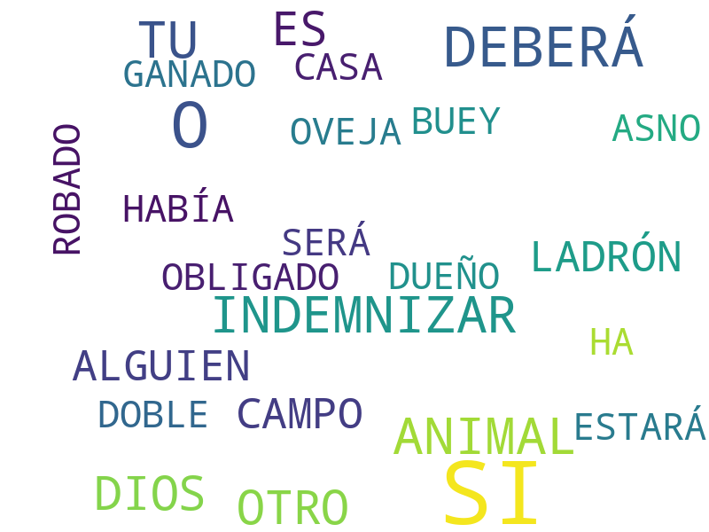

# Éxodo

1. Capítulo 1 [texto](texto_filtrado/AT/Éx/Éx_1.txt), 
2. Capítulo 2 [texto](texto_filtrado/AT/Éx/Éx_2.txt), 
3. Capítulo 3 [texto](texto_filtrado/AT/Éx/Éx_3.txt), 
4. Capítulo 4 [texto](texto_filtrado/AT/Éx/Éx_4.txt), 
5. Capítulo 5 [texto](texto_filtrado/AT/Éx/Éx_5.txt), 
6. Capítulo 6 [texto](texto_filtrado/AT/Éx/Éx_6.txt), 
7. Capítulo 7 [texto](texto_filtrado/AT/Éx/Éx_7.txt), 
8. Capítulo 8 [texto](texto_filtrado/AT/Éx/Éx_8.txt), 
9. Capítulo 9 [texto](texto_filtrado/AT/Éx/Éx_9.txt), 
10. Capítulo 10 [texto](texto_filtrado/AT/Éx/Éx_10.txt), 
11. Capítulo 11 [texto](texto_filtrado/AT/Éx/Éx_11.txt), 
12. Capítulo 12 [texto](texto_filtrado/AT/Éx/Éx_12.txt), 
13. Capítulo 13 [texto](texto_filtrado/AT/Éx/Éx_13.txt), 
14. Capítulo 14 [texto](texto_filtrado/AT/Éx/Éx_14.txt), 
15. Capítulo 15 [texto](texto_filtrado/AT/Éx/Éx_15.txt), 
16. Capítulo 16 [texto](texto_filtrado/AT/Éx/Éx_16.txt), 
17. Capítulo 17 [texto](texto_filtrado/AT/Éx/Éx_17.txt), 
18. Capítulo 18 [texto](texto_filtrado/AT/Éx/Éx_18.txt), 
19. Capítulo 19 [texto](texto_filtrado/AT/Éx/Éx_19.txt), 
20. Capítulo 20 [texto](texto_filtrado/AT/Éx/Éx_20.txt), 
21. Capítulo 21 [texto](texto_filtrado/AT/Éx/Éx_21.txt), 
22. Capítulo 22 [texto](texto_filtrado/AT/Éx/Éx_22.txt), 
23. Capítulo 23 [texto](texto_filtrado/AT/Éx/Éx_23.txt), 
24. Capítulo 24 [texto](texto_filtrado/AT/Éx/Éx_24.txt), 
25. Capítulo 25 [texto](texto_filtrado/AT/Éx/Éx_25.txt), 
26. Capítulo 26 [texto](texto_filtrado/AT/Éx/Éx_26.txt), 
27. Capítulo 27 [texto](texto_filtrado/AT/Éx/Éx_27.txt), 
28. Capítulo 28 [texto](texto_filtrado/AT/Éx/Éx_28.txt), 
29. Capítulo 29 [texto](texto_filtrado/AT/Éx/Éx_29.txt), 
30. Capítulo 30 [texto](texto_filtrado/AT/Éx/Éx_30.txt), 
31. Capítulo 31 [texto](texto_filtrado/AT/Éx/Éx_31.txt), 
32. Capítulo 32 [texto](texto_filtrado/AT/Éx/Éx_32.txt), 
33. Capítulo 33 [texto](texto_filtrado/AT/Éx/Éx_33.txt), 
34. Capítulo 34 [texto](texto_filtrado/AT/Éx/Éx_34.txt), 
35. Capítulo 35 [texto](texto_filtrado/AT/Éx/Éx_35.txt), 
36. Capítulo 36 [texto](texto_filtrado/AT/Éx/Éx_36.txt), 
37. Capítulo 37 [texto](texto_filtrado/AT/Éx/Éx_37.txt), 
38. Capítulo 38 [texto](texto_filtrado/AT/Éx/Éx_38.txt), 
39. Capítulo 39 [texto](texto_filtrado/AT/Éx/Éx_39.txt), 
40. Capítulo 40 [texto](texto_filtrado/AT/Éx/Éx_40.txt), 
