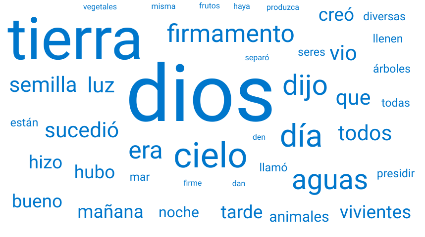
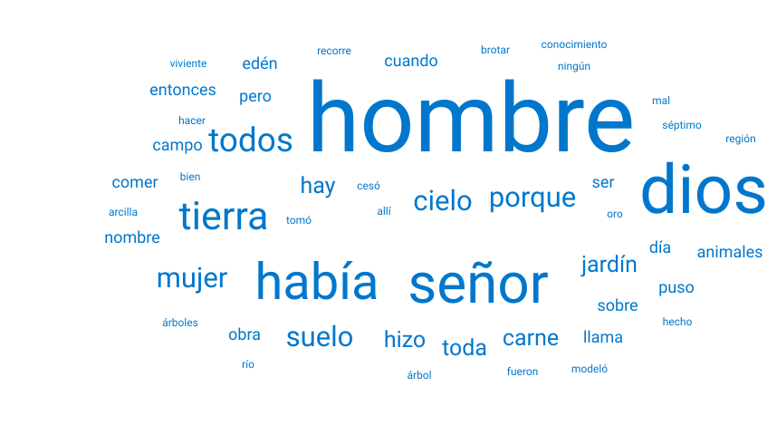

# temas_biblicos

Repositorio para hacer diagramas de markdown y plantuml de temas bíblicos

## Temas tratados

[libros de la Biblia](markdown/Libros_de_la_Biblia.md)

[Genealogía de Noé](markdown/Genealogia_de_Noe.md)

## Nuevos pasos a dar

- Crear una nube de palabras con cada capitulo de cada libro de la Biblia,

- Se ha subido varios textos a los que se les ha filtrados unas palabras con los [patrones](Biblia/texto_filtrado/patron-filtro.txt)
- Para extraer los textos utilizamos el navegador de consola **lynx** al que pasamos una URL y luego imprimimos el resultado de la pagina
  - lynx https://www.vatican.va/archive/ESL0506/__P3.HTM
    - para imprimir se pulsa [p] y luego se selecciona guardar, y se le pone nombre Gen1.txt
    - Se ha creado tres fases para limpiar los ficheros con lenguaje python, el fichero final, queda en mayúsculas y se eliminan las palabras como articulos, pronombres, preprosiciones, números, signos de puntuación...
 
    - para ejecutar los programas
      - /bin/python src/limpiar_fichero_1.py
      - /bin/python src/limpiar_fichero_2.py
      - /bin/python src/limpiar_fichero_3.py

- Para generar la nube de palabras nos hemos ayudado de esta herramiente [wordcloud](https://awario.com/es/wordcloud/) al que se le pasa el resultado del fichero fase3_gen1.txt y al generar la nubes de palabras se descarga el fichero en color negro y azul, el nombre Gen1.png es negro y Gen1_azul.png es azul

    - Gen [1](Biblia/texto_filtrado/AT/gen/gen1.txt), [2](Biblia/texto_filtrado/AT/gen/gen2.txt)
  - Imagenes
 
  - Gen 1

  

  - Gen 2

  
