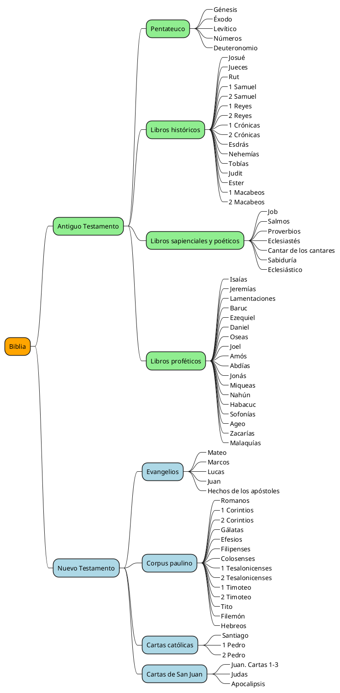
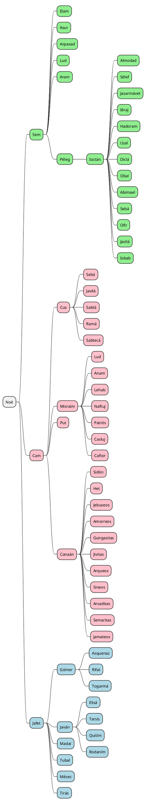

# temas_biblicos
Repositorio para hacer diagramas de markdown y plantuml de temas bíblicos

- Libros de la biblia

```plantuml
@startmindmap
*[#Orange] Biblia
**[#lightgreen] Antiguo Testamento
***[#lightgreen] Pentateuco
****_ Génesis
****_ Éxodo
****_ Levítico
****_ Números
****_ Deuteronomio
***[#lightgreen] Libros históricos
****_ Josué
****_ Jueces
****_ Rut
****_ 1 Samuel
****_ 2 Samuel
****_ 1 Reyes
****_ 2 Reyes
****_ 1 Crónicas
****_ 2 Crónicas
****_ Esdrás
****_ Nehemías
****_ Tobías
****_ Judit
****_ Ester
****_ 1 Macabeos
****_ 2 Macabeos
***[#lightgreen] Libros sapienciales y poéticos
****_ Job
****_ Salmos
****_ Proverbios
****_ Eclesiastés
****_ Cantar de los cantares
****_ Sabiduría
****_ Eclesiástico
***[#lightgreen] Libros proféticos
****_ Isaías
****_ Jeremías
****_ Lamentaciones
****_ Baruc
****_ Ezequiel
****_ Daniel
****_ Oseas
****_ Joel
****_ Amós
****_ Abdías
****_ Jonás
****_ Miqueas
****_ Nahún
****_ Habacuc
****_ Sofonías
****_ Ageo
****_ Zacarías
****_ Malaquías
**[#lightblue] Nuevo Testamento
***[#lightblue] Evangelios
****_ Mateo
****_ Marcos
****_ Lucas
****_ Juan
****_ Hechos de los apóstoles
***[#lightblue] Corpus paulino
****_ Romanos
****_ 1 Corintios
****_ 2 Corintios
****_ Gálatas
****_ Efesios
****_ Filipenses
****_ Colosenses
****_ 1 Tesalonicenses
****_ 2 Tesalonicenses
****_ 1 Timoteo
****_ 2 Timoteo
****_ Tito
****_ Filemón
****_ Hebreos
***[#lightblue] Cartas católicas
****_ Santiago
****_ 1 Pedro
****_ 2 Pedro
***[#lightblue] Cartas de San Juan
****_ Juan. Cartas 1-3
****_ Judas
****_ Apocalipsis
@endmindmap
```

- Genealigía de Noé

```plantuml
@startmindmap
* Noé
**[#lightgreen] Sem
***[#lightgreen] Elam
***[#lightgreen] Asur
***[#lightgreen] Arpaxad
***[#lightgreen] Lud
***[#lightgreen] Aram
***[#lightgreen] Péleg
****[#lightgreen] Ioctán
*****[#lightgreen] Almodad
*****[#lightgreen] Sélef
*****[#lightgreen] Jasarmávet
*****[#lightgreen] Iéraj
*****[#lightgreen] Hadoram
*****[#lightgreen] Uzal
*****[#lightgreen] Diclá
*****[#lightgreen] Obal
*****[#lightgreen] Abimael
*****[#lightgreen] Sebá
*****[#lightgreen] Ofir
*****[#lightgreen] Javilá
*****[#lightgreen] Iobab
**[#FFC0CB] Cam
***[#FFC0CB] Cus
****[#FFC0CB] Sebá
****[#FFC0CB] Javilá
****[#FFC0CB] Sabtá
****[#FFC0CB] Ramá
****[#FFC0CB] Sabtecá
***[#FFC0CB] Misraim
****[#FFC0CB] Lud
****[#FFC0CB] Anam
****[#FFC0CB] Lehab
****[#FFC0CB] Naftuj
****[#FFC0CB] Patrós
****[#FFC0CB] Casluj
****[#FFC0CB] Caftor
***[#FFC0CB] Put
***[#FFC0CB] Canaán
****[#FFC0CB] Sidón
****[#FFC0CB] Het
****[#FFC0CB] Jebuseos
****[#FFC0CB] Amorreos
****[#FFC0CB] Guirgasitas
****[#FFC0CB] Jivitas
****[#FFC0CB] Arqueos
****[#FFC0CB] Sineos
****[#FFC0CB] Arvaditas
****[#FFC0CB] Semaritas
****[#FFC0CB] Jamateos
**[#lightblue] Jafet
***[#lightblue] Gómer
****[#lightblue] Asquenaz
****[#lightblue] Rifat
****[#lightblue] Togarmá
***[#lightblue] Javán
****[#lightblue] Elisá
****[#lightblue] Tarsis
****[#lightblue] Quitím
****[#lightblue] Rodaním
***[#lightblue] Madai
***[#lightblue] Tubal
***[#lightblue] Mésec
***[#lightblue] Tirás
@endmindmap
```
