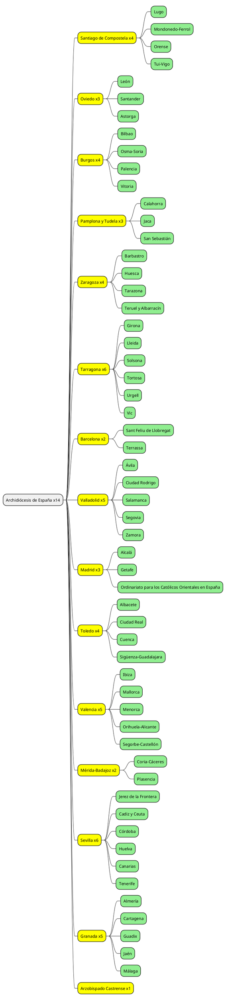

# Archidiócesis de España

En la Iglesia en España hay actualmente 69 diócesis territoriales, a las que hay que unir el Arzobispado Castrense. Cada diócesis o Iglesia particular dispone de su propia organización e instituciones diocesanas: seminario, residencias sacerdotales, colegios, etc. Además, el obispo diocesano puede erigir parroquias como comunidades de fieles constituidas de modo estable, encomendadas a un párroco. Generalmente las parroquias tienen carácter territorial.
Las diócesis limítrofes, con el fin de promover una acción pastoral común, se agrupan en catorce Provincias Eclesiásticas bajo la dirección del Metropolitano.

[Diócesis](https://www.conferenciaepiscopal.es/diocesis/)

acceso al [diocesis-españa.svg](src/diocesis-españa.svg)

