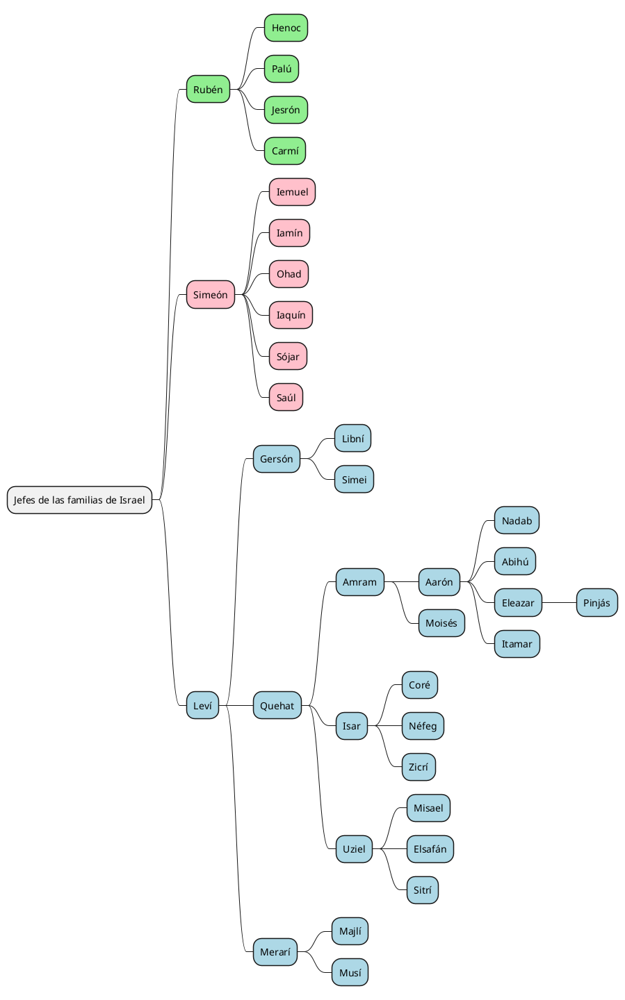

# Genealogía de Moises y Aaron

[Éx 6](https://www.vatican.va/archive/ESL0506/__P1M.HTM)

```plantuml
@startmindmap
* Jefes de las familias de Israel
**[#lightgreen] Rubén
***[#lightgreen] Henoc
***[#lightgreen] Palú
***[#lightgreen] Jesrón
***[#lightgreen] Carmí
**[#FFC0CB] Simeón
***[#FFC0CB] Iemuel
***[#FFC0CB] Iamín
***[#FFC0CB] Ohad
***[#FFC0CB] Iaquín
***[#FFC0CB] Sójar
***[#FFC0CB] Saúl
**[#lightblue] Leví
***[#lightblue] Gersón
****[#lightblue] Libní
****[#lightblue] Simei
***[#lightblue] Quehat
****[#lightblue] Amram
*****[#lightblue] Aarón
******[#lightblue] Nadab
******[#lightblue] Abihú
******[#lightblue] Eleazar
*******[#lightblue] Pinjás
******[#lightblue] Itamar
*****[#lightblue] Moisés
****[#lightblue] Isar
*****[#lightblue] Coré
*****[#lightblue] Néfeg
*****[#lightblue] Zicrí
****[#lightblue] Uziel
*****[#lightblue] Misael
*****[#lightblue] Elsafán
*****[#lightblue] Sitrí
***[#lightblue] Merarí
****[#lightblue] Majlí
****[#lightblue] Musí
@endmindmap
```