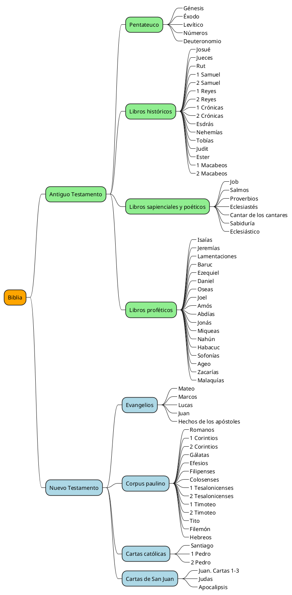

# Libros de la Biblia

```plantuml
@startmindmap
*[#Orange] Biblia
**[#lightgreen] Antiguo Testamento
***[#lightgreen] Pentateuco
****_ Génesis
****_ Éxodo
****_ Levítico
****_ Números
****_ Deuteronomio
***[#lightgreen] Libros históricos
****_ Josué
****_ Jueces
****_ Rut
****_ 1 Samuel
****_ 2 Samuel
****_ 1 Reyes
****_ 2 Reyes
****_ 1 Crónicas
****_ 2 Crónicas
****_ Esdrás
****_ Nehemías
****_ Tobías
****_ Judit
****_ Ester
****_ 1 Macabeos
****_ 2 Macabeos
***[#lightgreen] Libros sapienciales y poéticos
****_ Job
****_ Salmos
****_ Proverbios
****_ Eclesiastés
****_ Cantar de los cantares
****_ Sabiduría
****_ Eclesiástico
***[#lightgreen] Libros proféticos
****_ Isaías
****_ Jeremías
****_ Lamentaciones
****_ Baruc
****_ Ezequiel
****_ Daniel
****_ Oseas
****_ Joel
****_ Amós
****_ Abdías
****_ Jonás
****_ Miqueas
****_ Nahún
****_ Habacuc
****_ Sofonías
****_ Ageo
****_ Zacarías
****_ Malaquías
**[#lightblue] Nuevo Testamento
***[#lightblue] Evangelios
****_ Mateo
****_ Marcos
****_ Lucas
****_ Juan
****_ Hechos de los apóstoles
***[#lightblue] Corpus paulino
****_ Romanos
****_ 1 Corintios
****_ 2 Corintios
****_ Gálatas
****_ Efesios
****_ Filipenses
****_ Colosenses
****_ 1 Tesalonicenses
****_ 2 Tesalonicenses
****_ 1 Timoteo
****_ 2 Timoteo
****_ Tito
****_ Filemón
****_ Hebreos
***[#lightblue] Cartas católicas
****_ Santiago
****_ 1 Pedro
****_ 2 Pedro
***[#lightblue] Cartas de San Juan
****_ Juan. Cartas 1-3
****_ Judas
****_ Apocalipsis
@endmindmap
```