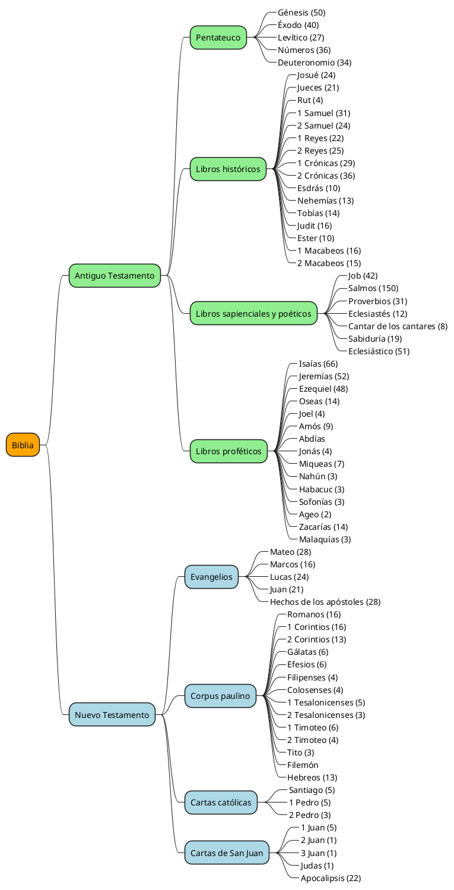

# Libros de la Biblia

[link](https://www.conferenciaepiscopal.es/biblia/)

```plantuml
@startmindmap
*[#Orange] Biblia
**[#lightgreen] Antiguo Testamento
***[#lightgreen] Pentateuco
****_ Génesis (50)
****_ Éxodo (40)
****_ Levítico (27)
****_ Números (36)
****_ Deuteronomio (34)
***[#lightgreen] Libros históricos
****_ Josué (24)
****_ Jueces (21)
****_ Rut (4)
****_ 1 Samuel (31)
****_ 2 Samuel (24)
****_ 1 Reyes (22)
****_ 2 Reyes (25)
****_ 1 Crónicas (29)
****_ 2 Crónicas (36)
****_ Esdrás (10)
****_ Nehemías (13)
****_ Tobías (14)
****_ Judit (16)
****_ Ester (10)
****_ 1 Macabeos (16)
****_ 2 Macabeos (15)
***[#lightgreen] Libros sapienciales y poéticos
****_ Job (42)
****_ Salmos (150)
****_ Proverbios (31)
****_ Eclesiastés (12)
****_ Cantar de los cantares (8)
****_ Sabiduría (19)
****_ Eclesiástico (51)
***[#lightgreen] Libros proféticos
****_ Isaías (66)
****_ Jeremías (52)
****_ Ezequiel (48)
****_ Oseas (14)
****_ Joel (4)
****_ Amós (9)
****_ Abdías
****_ Jonás (4)
****_ Miqueas (7)
****_ Nahún (3)
****_ Habacuc (3)
****_ Sofonías (3)
****_ Ageo (2)
****_ Zacarías (14)
****_ Malaquías (3)
**[#lightblue] Nuevo Testamento
***[#lightblue] Evangelios
****_ Mateo (28)
****_ Marcos (16)
****_ Lucas (24)
****_ Juan (21)
****_ Hechos de los apóstoles (28)
***[#lightblue] Corpus paulino
****_ Romanos (16)
****_ 1 Corintios (16)
****_ 2 Corintios (13)
****_ Gálatas (6)
****_ Efesios (6)
****_ Filipenses (4)
****_ Colosenses (4)
****_ 1 Tesalonicenses (5)
****_ 2 Tesalonicenses (3)
****_ 1 Timoteo (6)
****_ 2 Timoteo (4)
****_ Tito (3)
****_ Filemón
****_ Hebreos (13)
***[#lightblue] Cartas católicas
****_ Santiago (5)
****_ 1 Pedro (5)
****_ 2 Pedro (3)
***[#lightblue] Cartas de San Juan
****_ 1 Juan (5)
****_ 2 Juan (1)
****_ 3 Juan (1)
****_ Judas (1)
****_ Apocalipsis (22)
@endmindmap
```
